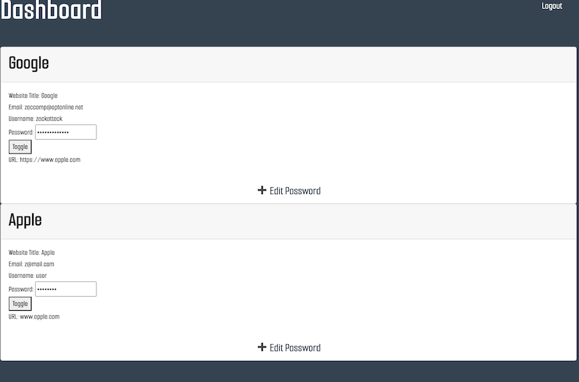

# Personal Info Locker
  
## Description 

  
An application that holds your personal login information for each and every website you need. This project was built using Express.js, Sequelize, and Handlebars

## Table of Contents
* [Installation](#Installation)
* [Usage](#Usage)
* [License](#License)
* [Contributing](#Contributing)
* [To-Dos](#To-Dos)
* [Credits](#Credits)
* [Questions](#Questions)

## Installation
Clone this repository to your computer. Navigate to the root folder then run `npm init` or `npm init -y`. Then run either `npm i` or `npm install` to install the local dependencies

  
## Usage
Open a separate command line and start mysql with the command `mysql -u root p`, then enter your password. Create the database by running the command `source db/schema.sql`. Select the database to use by running `USE personal_info_locker_db`. Then you may exit mysql. To start the application, use either `node server.js` or `npm start`

  
  
  
  

## License
A short and simple permissive license with conditions only requiring preservation of copyright and license notices. Licensed works, modifications, and larger works may be distributed under different terms and without source code.  

## Contributing
Anyone is able to contribute to our project.

1.	Fork the project on GitHub
2.	Add your modified files to Git
    `git add path/to/filename.ext`
    OR:
    `git add .`
3.	Commit your changes using a descriptive commit message.
    `git commit -m "Brief Description of Commit"`
4.	Push your commits to your GitHub Fork:
    `git push -u origin branch-name`
5.	Submit a pull request.

## To-Dos
- Add field for credit card information
- Add secure note section
- Allow user to directly copy the password field by clicking on it

## Credits
The [vanilla-js-show-hide-password package](https://github.com/nauvalazhar/vanilla-js-show-hide-password) was made by [nauvalazhar](https://github.com/nauvalazhar)   

## Questions
If you have any questions, concerns, or comments, feel free to contact us:
  
-GitHub: [Zacharycampanelli](https://github.com/Zacharycampanelli)  
-GitHub: [danielle-gan](https://github.com/danielle-gan)  
-GitHub: [marikadicarlo](https://github.com/marikadicarlo)  
-GitHub: [irvensd](https://github.com/irvensd)  

## Link to Deployed Application
-[Heroku](https://sleepy-cove-57890.herokuapp.com/)